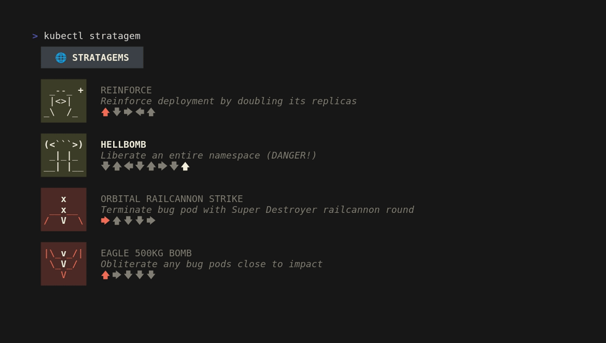

# kubectl-stratagem

*Call in stratagems on your Kubernetes components, FOR LIBERTY, FOR FREEDOM,
**FOR MANAGED DEMOCRACY***



## Development

Requires Go 1.21 (or later)

```bash
go run .
```

## License

I've not yet decided what license to use for this project, which means it's
not yet open-source.
